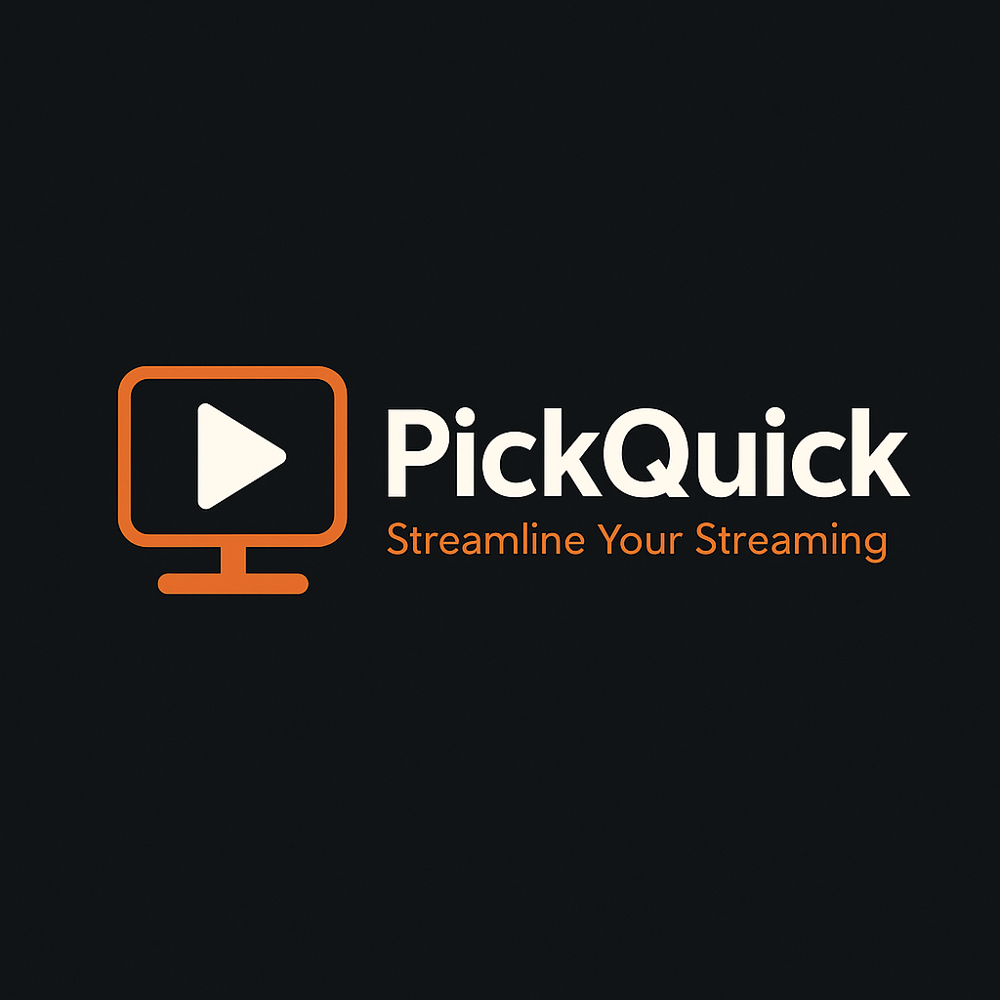

# PickQuick

## Project Overview

**PickQuick** is a movie recommendation platform that lets users quickly discover new content tailored to their preferences. Users can filter by genres and streaming providers, receive random curated picks from a larger pool, and save movies to their personal "To Watch" list. The goal is to reduce decision fatigue by giving fast, relevant, and fun recommendations without endlessly scrolling through streaming platforms. 

---

Struck through items are temporarily disabled for backend overhaul. Sign-in options have temporarily been removed effectively making this a frontend only for the time being.

## Features

- **Streaming Provider Filtering** Choose specific streaming services or search across all.
- **Randomized Recommendations** From the filtered results, 5 random picks are shown to reduce decision fatigue.
- ~~**"To Watch" List** Save movies for later viewing with a single click.~~ 
- ~~**User Accounts** Secure login and profile management via Clerk.~~
- **Cross-Platform Access** Works on desktop and mobile browsers.


## Technologies Used

### 🖥️ Frontend

- **React** – Component-based UI development
- **Vite** – Fast build tool and development server
- **React Router DOM** – Client-side routing for navigating between views
- **Context API** – State management across components
~~- **Clerk Authentication** – Safe and secure user authentication~~
- **The Movie Database (TMDB)** – API for movie data 

### ⚙️ Backend

- **Java & Spring Boot** – RESTful APIs and server-side logic
~~- **Clerk Webhooks** – Account event handling (planned for lifecycle support)~~
- **CORS** – Config security
- **MySQL** – Object Relational Database

### 🧩 Infrastructure & Dev Tools

- **IntelliJ** – Dev environment
~~- **Clerk** – Complete auth suite (signup, sessions, secure JWT)~~
- **Visual Studio Code** – Dev environment
- **Postman** – API testing and debugging

## 🧰 Prerequisites

### 🖥️ General
- **Git** – For cloning repositories  
  [Download Git](https://git-scm.com/)
- **Node.js (v18 or above)** – Required for the React frontend  
  [Download Node.js](https://nodejs.org/)
- **Java 17+ & Maven** – Required to run the Spring Boot backend  
  [Java](https://adoptium.net/) | [Maven](https://maven.apache.org/install.html)

### 🗃️ Local Database
- **MySQL** – For running and interacting with your local database  
  [MySQL Download](https://www.mysql.com/downloads/)  


<br>

## Installation

You'll need an [API key from TMDb](https://developer.themoviedb.org/docs/getting-started) ~~and a [Clerk account](https://clerk.com/) for full functionality.~~

To install and run the PickQuick application locally, follow these steps:

---

### 🛠 Backend Setup

1. Clone the repository:
   ```bash
   git clone https://github.com/MelissaHarper/launchcode-fullstack-project.git
   ```

2. Navigate to the backend project directory:
   ```bash
   cd backend
   ```

   Or open it in your preferred development environment

3. Configure your environment variables:
Use the included example.env file to create your own .env file and fill in your sensitive data.


4. Build and run the Spring Boot app:
   ```bash
   mvn spring-boot:run
   ```

The backend will be available at `http://localhost:8080`

### 🎨 Frontend Setup

#### Second verse, same as the first

1. Clone the repository:
```
git clone https://github.com/MelissaHarper/launchcode-fullstack-project.git
```

2. Navigate to the project directory:
```
cd frontend
```

3. Install the dependencies:
```
npm install
```

4. Configure your environment variables:

5. Start the development server:
```
npm run dev
```

The application will be available at `http://localhost:5173`.


